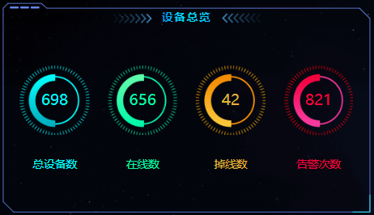

# vue项目学习

### pinia状态组件库

##### 介绍：

pinia是vue的专属状态管理库，它允许你跨组件或页面共享状态


##### **pinia的使用：**


<div style="color: red; text-align: center; font-weight: bold;">
    借助pinia共享token比较繁琐，请求前需要执行的重复性代码可以放到axios请求拦截器里面
</div>


### Axios请求拦截器

##### 介绍：

添加axios请求拦截器与添加响应拦截器类似

##### 响应拦截器：

###### 代码：

```javascript
// 导入axios  npm install axios
import axios from "axios";
import { ElMessage } from "element-plus";

// 定义一个变量,记录公共的前缀, baseURL
const baseURL = "/api";
const instance = axios.create({ baseURL });

// 添加响应拦截器
// 请求成功处理数据
// 请求失败处理错误
instance.interceptors.response.use(
   (result) => {
      if (result.data.code === 0) {
         return result.data;
      }

      // 操作失败
      // alert(result.data.msg ? result.data.msg : "服务异常");
      ElMessage.error(result.data.msg ? result.data.msg : "服务异常");
      return Promise.reject(result.data); // 异步的状态转化成失败的状态
   },
   (err) => {
      alert("服务异常");
      return Promise.reject(err); // 异步的状态转化成失败的状态
   }
);

export default instance;
```

###### vsc截图：

##### 

#### 请求拦截器：

###### 代码：

在request.js中：

```
//定制请求的实例

//导入axios  npm install axios
import axios from "axios";

import { ElMessage } from "element-plus";
//定义一个变量,记录公共的前缀  ,  baseURL
const baseURL = "/api";
const instance = axios.create({ baseURL });

import { useTokenStore } from "@/stores/token";
//添加请求拦截器
instance.interceptors.request.use(
   (config) => {
      // 获取token
      const tokenStore = useTokenStore();
      //判断有没有token
      if (tokenStore.token) {
         config.headers.Authorization = tokenStore.token;
      }
      return config;
   },
   (err) => {
      Promise.reject(err);
   }
);

//添加响应拦截器
//请求成功处理数据
//请求失败处理错误
instance.interceptors.response.use(
   (result) => {
      if (result.data.code === 0) {
         return result.data;
      }

      //操作失败
      //   alert(result.data.msg ? result.data.msg : "服务异常");
      ElMessage.error(result.data.msg ? result.data.msg : "服务异常");
      return Promise.reject(result.data); //异步的状态转化成失败的状态
   },
   (err) => {
      alert("服务异常");
      return Promise.reject(err); //异步的状态转化成失败的状态
   }
);

export default instance;
```

在article.js中：

```
import request from "@/utils/request";
import { useTokenStore } from "@/stores/token";

// 获取文章分类列表
export function articleCategoryListService() {
   const tokenStore = useTokenStore();
   return request({
      url: "/category",
      method: "get",
      //在request中的请求拦截器中已经判断了是否携带token
      //可以不携带
      // headers: {
      //    Authorization: tokenStore.token,
      // },
   });
}
```


###### 截图：


### pinia持久化插件-persist：

##### 介绍：

pinia默认是内存存储，当刷新浏览器的时候会丢失数据。

persist插件可以将pinia中的数据持久化存储

安装persist：yarn add pinia-persistedstate-plugin

##### 使用：


##### 代码：

```javascript
import { createPinia } from "pinia";
import { createPersistedState } from "pinia-persistedstate-plugin";
const pinia = createPinia();
const persist = createPersistedState();

// 使用pinia-persistedstate插件
pinia.use(persist);
// 使用pinia
app.use(pinia);
```

然后在token.js里面持久化token

```
//定义store
import { defineStore } from "pinia";
import { ref } from "vue";

export const useTokenStore = defineStore(
   "token",
   () => {
      //定义状态的内容

      //响应式数据
      const token = ref("");

      //定义方法，修改token
      const setToken = (newToken) => {
         token.value = newToken;
      };
      //定义方法，移除token
      const removeToken = () => {
         token.value = "";
      };
      return {
         token,
         setToken,
         removeToken,
      };
   },
   //使用pinia-persistedstate插件持久化存储
   {
      persist: true,
   }
);
```


### 进入网站强制跳转login

当用户进入网站时候直接显示了登录之后的页面，

我们需要在响应拦截器里面添加判断当响应码为401时候显示未登录，给出对应的提示，并跳转到登录页面

##### 使用：


##### 代码：

```
//定制请求的实例

//导入axios  npm install axios
import axios from "axios";

import { ElMessage } from "element-plus";
//定义一个变量,记录公共的前缀  ,  baseURL
const baseURL = "/api";
const instance = axios.create({ baseURL });

import { useTokenStore } from "@/stores/token";
//添加请求拦截器
instance.interceptors.request.use(
   (config) => {
      // 获取token
      const tokenStore = useTokenStore();
      //判断有没有token
      if (tokenStore.token) {
         config.headers.Authorization = tokenStore.token;
      }
      return config;
   },
   (err) => {
      Promise.reject(err);
   }
);

import router from "@/router";
//添加响应拦截器
//请求成功处理数据
//请求失败处理错误
instance.interceptors.response.use(
   (result) => {
      if (result.data.code === 0) {
         return result.data;
      }

      //操作失败
      //   alert(result.data.msg ? result.data.msg : "服务异常");
      ElMessage.error(result.data.msg ? result.data.msg : "服务异常");
      return Promise.reject(result.data); //异步的状态转化成失败的状态
   },
   (err) => {
      //判断响应状态码，如果是401，则跳转到登录页面
      if (err.response.status === 401) {
         // 跳转到登录页面
         ElMessage.error("请先登录");
         router.push("/login");
      } else {
         ElMessage.error("服务异常");
      }
      return Promise.reject(err); //异步的状态转化成失败的状态
   }
);

export default instance;

```

### 编辑分类数据时候回显操作

# onMounted函数

是的，`onMounted(() => { chartinit(); })` 通常用来在 Vue 3 组件生命周期的 **`mounted` 阶段** 调用某个函数，比如初始化一个功能或设置一些逻辑。在这个上下文中，您提到的 `chartinit()` 应该是一个用于初始化图表的函数。

---

### **`onMounted` 生命周期钩子**

`onMounted` 是 Vue 3 中的一个生命周期钩子函数，作用是在组件的 DOM **挂载到页面上**后执行某些逻辑。通常用来完成以下任务：
- 初始化操作（例如渲染图表、获取 DOM 节点、第三方库的初始化等）。
- 数据获取（如从 API 拉取数据）。
- 注册事件监听器。

#### 官方说明：
在组件被挂载到 DOM 后，`onMounted` 会被调用。此时，您可以安全地操作 DOM，因为这时 DOM 已经被渲染完成。

---

### **为什么要在 `onMounted` 中初始化？**

在 Vue 的组件生命周期中，以下是关键的几个阶段：
1. **`beforeMount`**: 组件实例已经创建，但 DOM 尚未挂载。
2. **`mounted`**: DOM 挂载完成，可以安全操作 DOM。
3. **`beforeUnmount`**: 组件即将被销毁，但 DOM 仍然存在。
4. **`unmounted`**: 组件和 DOM 已经完全销毁。

如果在 `beforeMount` 或 setup 函数中尝试初始化图表，可能会导致报错，因为 DOM 元素尚未挂载，找不到对应的图表容器。

通过在 `onMounted` 中进行初始化，可以确保：
- 组件的 DOM 已经挂载到页面。
- 初始化图表、DOM 操作等能够顺利进行。

---

### **总结**

- 您的代码 `onMounted(() => { chartinit(); })` 是一种常见的模式，确实是用于 **初始化的操作**。
- 这种写法确保了图表或其他逻辑会在组件挂载后执行。
- 如果您的目标是初始化图表，`chartinit()` 函数应该包含图表实例的创建、配置和绑定等过程。


# 使用Echarts的操作

[【数据可视化】在vue3中使用echarts_哔哩哔哩_bilibili](https://www.bilibili.com/video/BV1xa411D7qK/?spm_id_from=333.337.search-card.all.click&vd_source=ab4358b9671d194c9e0a9fec4d1b62d9)

## **`computed`**的用法

**手动维护派生数据的更新逻辑**，简单来说，就是当一个数据是依赖其它数据计算得出时，你需要手动编写代码来同步更新这个派生数据，而不是自动计算和更新。这种方式不仅容易出错，还会导致代码冗长、不易维护。

在 Vue 3 的 Composition API 中，`computed` 就是用来解决这个问题的。它会**自动追踪依赖关系**，并在依赖的数据发生变化时，自动重新计算并更新派生数据，从而避免手动维护派生数据的逻辑。

---

### **手动维护派生数据的更新逻辑示例**

#### **问题：手动实现派生数据（没有 `computed`）**

假设我们有两个响应式数据 `price` 和 `quantity`，我们需要计算一个 `totalPrice`（总价）：

```javascript
import { ref } from 'vue';

export default {
  setup() {
    const price = ref(100);      // 单价
    const quantity = ref(2);    // 数量
    const totalPrice = ref(price.value * quantity.value); // 总价（手动计算）

    // 如果修改了 price 或 quantity，我们必须手动更新 totalPrice
    function updatePrice(newPrice) {
      price.value = newPrice;
      totalPrice.value = price.value * quantity.value; // 手动更新逻辑
    }

    function updateQuantity(newQuantity) {
      quantity.value = newQuantity;
      totalPrice.value = price.value * quantity.value; // 手动更新逻辑
    }

    return { price, quantity, totalPrice, updatePrice, updateQuantity };
  }
};
```

**缺点：**
1. **需要手动更新 `totalPrice`**：当 `price` 或 `quantity` 修改时，开发者必须记得在每个修改函数中都同步更新 `totalPrice`。
2. **容易出错**：如果忘了在某处更新 `totalPrice`，那么数据和视图会失去同步（即「数据不一致」）。
3. **代码冗长**：对于每个依赖的值，你都需要手动写更新逻辑，代码复杂性会随着应用规模增大而增加。

---

### **解决：使用 `computed` 自动维护派生数据**

使用 `computed`，你无需手动更新派生数据，Vue 会自动追踪依赖关系，并在依赖的响应式数据发生变化时，自动重新计算派生数据。

#### **优化后的代码：**

```javascript
import { ref, computed } from 'vue';

export default {
  setup() {
    const price = ref(100);      // 单价
    const quantity = ref(2);    // 数量

    // 使用 computed 自动计算和维护总价
    const totalPrice = computed(() => price.value * quantity.value);

    function updatePrice(newPrice) {
      price.value = newPrice;    // 无需手动更新 totalPrice
    }

    function updateQuantity(newQuantity) {
      quantity.value = newQuantity; // 无需手动更新 totalPrice
    }

    return { price, quantity, totalPrice, updatePrice, updateQuantity };
  }
};
```

#### **程序运行：**
- 当 `price` 或 `quantity` 改变时，`computed` 会自动重新计算 `totalPrice` 的值。
- 你不需要手动同步 `totalPrice`，Vue 会帮你管理所有依赖关系。

---

### **手动维护 VS 自动维护的对比**

| **特性**             | **手动维护派生数据**                             | **使用 computed 自动维护派生数据**           |
| -------------------- | ------------------------------------------------ | -------------------------------------------- |
| **更新逻辑**         | 开发者需要手动更新每个派生数据                   | Vue 自动追踪依赖并更新，开发者无需手动维护   |
| **代码复杂性**       | 随着依赖数据的增加，手动同步逻辑会变得复杂且冗长 | 无需额外同步逻辑，代码简洁易维护             |
| **容易出错的可能性** | 容易因忘记更新派生数据导致「数据不一致」         | Vue 自动管理依赖数据，不容易出错             |
| **性能**             | 手动同步可能会有冗余计算                         | 依赖变化时才重新计算，性能更优               |
| **适用场景**         | 复杂逻辑或特定场景下才需要手动管理               | 适合派生数据场景，尤其是简单的计算和依赖关系 |

---

主要就是如果在一个函数里面修改了单价和数量的画这时候由于totalPrice也需要更新但是我们没有使用computed所以我们只能手动更新

但是使用了computed我们就不用手动更新这些数据了

## setInterval的定义和作用

`setInterval` 是 JavaScript 中的一个内置函数，用于**按照固定时间间隔重复执行某个代码块或函数**。

#### **语法**

```javascript
setInterval(callback, delay, ...args);
```

- **`callback`**（必需）：一个需要重复执行的函数。
- **`delay`**（必需）：以毫秒为单位的时间间隔（1秒 = 1000毫秒）。
- **`...args`**（可选）：传递给 `callback` 函数的参数。

#### **返回值**
`setInterval` 返回一个唯一的 ID（数字），可通过 `clearInterval`）。

---

### **`setInterval` 的用途**

1. **重复执行任务**：每隔固定时间执行代码，例如每秒更新一个计数器。
2. **实现简单的轮询**：定期检查某些条件是否满足。
3. **动画效果**：实现简单的动画逻辑（不过现在推荐使用 `requestAnimationFrame` 进行动画处理）。

---


## 路由创建

首先导入vue-router插件

然后写一下路由 可以使用createWebHistory也可以使用

```javascript
import { createRouter, createWebHistory } from "vue-router";

// 创建路由
const router = createRouter({
   history: createWebHistory(),
   routes: [
      {
         path: "/login",
         component: () => import("../views/Login.vue"),
      },
      {
         path: "/",
         component: () => import("../views/Layout.vue"),
         redirect: "/article/manage",
         children: [
            {
               path: "/article/category",
               component: () => import("../views/article/ArticleCategory.vue"), //文章分类
            },
            {
               path: "/article/manage",
               component: () => import("../views/article/ArticleManage.vue"), //文章管理
            },
            {
               path: "/user/avatar",
               component: () => import("../views/user/UserAvatar.vue"), //用户头像
            },
            {
               path: "/user/info",
               component: () => import("../views/user/UserInfo.vue"), //用户信息
            },
            {
               path: "/user/password",
               component: () => import("../views/user/UserResetPassword.vue"), //用户密码
            },
         ],
      },
   ],
});

// 导出路由
export default router;

```

可以像下面这样使用

```javascript
      //登录函数
   import { useTokenStore } from "@/stores/token";
   import { userLoginService } from "../api/user.js";
   import { useRouter } from "vue-router";
   const router = useRouter();
   const tokenStore = useTokenStore();
   const login = async () => {
      let result = await userLoginService(registerData.value);
      // if (result.code === 0) {
      //    //成功
      //    alert(result.msg ? result.msg : "登录成功");
      // } else {
      //    //失败
      //    alert("登录失败");
      // }
      // alert(result.msg ? result.msg : "登录成功");
      ElMessage.success(result.msg ? result.msg : "登录成功");
      // 将token存储到pinia中
      tokenStore.setToken(result.data);
      // 跳转到首页
      router.push("/");
   };
```

## kjgl77/datav-vue3

[DataV Vue3+TS+Vite版 | DataV - Vue3](https://datav-vue3.netlify.app/Guide/Guide.html)

`@kjgl77/datav-vue3` 是一个用于 Vue 3 的数据可视化插件库，基于 Vue 3 构建，通常用于快速搭建数据可视化项目。它提供了许多常用的、封装好的数据可视化组件，可以直接在 Vue 3 项目中使用。

这是一个开源插件（可以在 NPM 或 GitHub 上找到相关信息），其目标是帮助开发者在数据展示和大屏设计中更高效地创建可视化界面。

---

### 功能和特点

1. **专注于大屏数据可视化**
   - 该插件提供许多适用于数据大屏的工具和组件，比如常用的边框装饰、背景动画、标题装饰等。
   - 适合用来开发企业级数据大屏、监控面板等项目。

2. **丰富的内置组件**
   - 包括数字翻牌器、动态边框、渐变标题、进度条等。
   - 这些组件常用于构建酷炫的大屏展示效果。

3. **基于 Vue 3 和 Composition API**
   - 充分利用 Vue 3 的新特性，易于集成到 Vue 3 的项目中。
   - 组件的使用非常简单，只需在项目中引入即可。

4. **高自由度的定制**
   - 提供了许多参数来控制组件的样式和行为，开发者可以根据需求调整。

5. **轻量级**
   - 该库经过优化，体积较小，对项目的性能影响较低。

---

### 常见用途
- **数据可视化大屏**
  - 比如智慧城市、企业运营监控、实时数据展示。
- **仪表盘**
  - 比如 KPI 指标显示、数据统计。
- **动态特效展示**
  - 提供酷炫的动态视觉效果，提升用户的视觉体验。

---

### 示例用法

#### 1. 安装插件
在 Vue 3 项目中安装插件，可以通过 npm 或 yarn 安装：

```bash
npm install @kjgl77/datav-vue3
# 或者
yarn add @kjgl77/datav-vue3
```

#### 2. 在项目中引入

在主入口文件中（如 `main.js`）引入并注册：

```javascript
import { createApp } from 'vue';
import App from './App.vue';
import DataVVue3 from '@kjgl77/datav-vue3';   // 引入插件

const app = createApp(App);
app.use(DataVVue3);   // 注册插件
app.mount('#app');
```

#### 3. 使用组件
在页面或组件中使用插件提供的组件，比如一个边框装饰组件：

```vue
<template>
  <div style="width: 300px; height: 200px;">
    <dv-border-box-1>
      <div>这是一个带边框的内容区域</div>
    </dv-border-box-1>
  </div>
</template>
```

---

### 提供的主要组件
`@kjgl77/datav-vue3` 提供的组件种类繁多，以下是一些常见组件：
1. **边框装饰**
   - `dv-border-box-1` ~ `dv-border-box-13`：不同样式的动态边框装饰组件。
2. **标题装饰**
   - `dv-decoration-1` ~ `dv-decoration-10`：标题动态装饰。
3. **数字翻牌器**
   - `dv-digital-flop`：动态数字展示组件。
4. **动态进度条**
   - `dv-percent-pond`：支持动画的进度条。
5. **全屏容器**
   - `dv-full-screen-container`：用于创建全屏大屏容器。
6. **背景动画**
   - `dv-bg-box`：支持动态背景效果。

---

### 总结
`@kjgl77/datav-vue3` 是一个非常方便的 Vue 3 数据可视化插件，适用于快速开发数据大屏和数据可视化项目。如果你正在从事相关工作，可以尝试使用它来节省开发时间，并提升界面效果。当然，如果你的项目有更复杂的需求，还可以结合其他库（例如 ECharts 等）使用。

## 第一部分


这里使用nth-child来指明对应组件的css样式

蓝色：1 4 7     橙色：2 5 8    青色：3 6 9


## 使用Echarts实现图表

[事件与行为 - 概念篇 - 使用手册 - Apache ECharts](https://echarts.apache.org/handbook/zh/concepts/event)


```javascript
<script setup>
   import { ref, onMounted } from "vue";
   import * as echarts from "echarts";

   let chart = ref();
   let myChart; // 定义全局变量，用于保存图表实例
   let isColorChanged = false; // 用于记录颜色是否已经被切换

   onMounted(() => {
      chartinit();
   });

   // 初始化图表
   function chartinit() {
      // 基于准备好的 DOM，初始化 ECharts 实例
      myChart = echarts.init(chart.value);

      // 配置图表选项
      var option = {
         title: {
            text: "巡查上报记录数量", // 标题
            textStyle: {
               color: "#F0EDEE", // 设置文字颜色为红色
               fontSize: 15, // 设置文字大小
               fontWeight: "bold", // 设置文字加粗
            },
         },
         tooltip: {}, // 鼠标悬浮提示框
         //  legend: {
         //     data: ["销量"], // 图例
         //     textStyle: {
         //        color: "#FF0000", // 设置文字颜色为红色
         //        fontSize: 16, // 设置文字大小
         //        fontWeight: "bold", // 设置文字加粗
         //     },
         //  },
         xAxis: {
            type: "value",
            axisLine: {
               lineStyle: {
                  color: "#fff",
               },
            },
         },
         yAxis: {
            type: "category",
            data: ["衬衫", "羊毛衫", "雪纺衫", "裤子", "高跟鞋", "袜子"],
            axisLine: {
               lineStyle: {
                  color: "#fff",
               },
            },
         }, // Y轴
         series: [
            {
               name: "销量",
               type: "bar", // 柱状图类型
               data: [5, 20, 36, 10, 10, 20], // 数据
               barWidth: 40, // 柱状条宽度
               itemStyle: {
                  color: function (params) {
                     var colorList = [
                        "#ffdb5c",
                        "#fb7293",
                        "#67e0e3",
                        "#9d96f5",
                        "#8378ea",
                        "#e690d1",
                     ]; // 自定义颜色列表
                     return colorList[params.dataIndex];
                  }, // 设置初始柱状条颜色
               },
            },
         ],
         toolbox: {
            show: true,//显示工具栏
            feature: {
               magicType: {
                  type: ["line", "bar"], // 切换为折线图和柱状图
               },
               restore: {
                  show: true,
               },
               saveAsImage: {
                  show: true,
               },
            },
         },
      };

      // 使用配置项和数据显示图表
      myChart.setOption(option);
   }
</script>

<template>
   <div ref="chart" style="width: 100%; height: 500px"></div>
</template>

<!-- scoped 只作用于当前组件 -->
<style scoped></style>
```

## flex布局


在 CSS 中，`flex` 属性是弹性布局（Flexbox）中用来指定子元素如何分配空间的简写属性。它是以下三个属性的简写形式：

```css
flex: [flex-grow] [flex-shrink] [flex-basis];
```

下面我们来具体解释您提到的 `flex: 0 1 60%;` 和 `flex: 0 1 40%;` 中各个值的含义：

---

### 1. `flex-grow` (第一个值)
- 值：`0`
- 含义：
  - `flex-grow` 决定子元素在父容器中如何 **按比例增长**。
  - 如果值为 `0`，表示这个子元素**不会根据剩余空间来增长**。
  - 如果值为正数（如 `1` 或更大），则表示这个子元素可以根据剩余空间增长，并且 `flex-grow` 的值越大，增长的比例越大。

---

### 2. `flex-shrink` (第二个值)
- 值：`1`
- 含义：
  - `flex-shrink` 决定子元素在父容器空间不足时如何**按比例缩小**。
  - 如果值为 `1`，表示这个子元素可以根据父容器的空间不足而缩小。
  - 如果值为 `0`，表示这个子元素不会缩小，无论父容器的空间是否不足。

---

### 3. `flex-basis` (第三个值)
- 值：`60%` 或 `40%`
- 含义：
  - `flex-basis` 决定子元素的**初始大小**，通常是长度单位（如 `px`、`%` 等）或 `auto`。
  - 在 `flex-basis` 的基础上，通过 `flex-grow` 和 `flex-shrink` 的值来动态调整子元素的实际大小。
  - `60%` 意味着这个子元素的初始宽度会占父容器的 60%，`40%` 则占父容器的 40%。

---

### 结合起来看：`flex: 0 1 60%;` 和 `flex: 0 1 40%;`

1. **`flex: 0 1 60%;`**
   - `flex-grow: 0`: 不会基于父容器的剩余空间增长。
   - `flex-shrink: 1`: 当父容器空间不足时，这个子元素会按比例缩小。
   - `flex-basis: 60%`: 初始宽度为父容器的 60%。

   解释：这个元素的宽度默认占父容器的 60%，当空间不足时，它可以缩小，但不会因为有多余空间而变大。

2. **`flex: 0 1 40%;`**
   - `flex-grow: 0`: 不会基于父容器的剩余空间增长。
   - `flex-shrink: 1`: 当父容器空间不足时，这个子元素会按比例缩小。
   - `flex-basis: 40%`: 初始宽度为父容器的 40%。

   解释：这个元素的宽度默认占父容器的 40%，当空间不足时，它可以缩小，但不会因为有多余空间而变大。

---

### 举例说明

假设父容器的宽度是 1000px：

1. 如果父容器有足够的空间：
   - `.modulethird-left` 宽度为 60% × 1000 = **600px**。
   - `.modulethird-right` 宽度为 40% × 1000 = **400px**。

2. 如果父容器空间不足（比如宽度只有 800px）：
   - 两个子元素会按比例缩小（因为 `flex-shrink` 是 `1`），但是它们的缩小比例由它们的初始宽度决定。
   - `.modulethird-left` 和 `.modulethird-right` 的宽度会按比例重新分配。

3. 如果父容器有多余空间（比如宽度是 1200px）：
   - 子元素的宽度仍然是 `600px` 和 `400px`，因为 `flex-grow` 是 `0`，它们不会根据剩余空间增长。

---

### 总结

- **`flex-grow`（第一个值）**：控制元素是否基于剩余空间增长。
- **`flex-shrink`（第二个值）**：控制元素是否基于不足空间缩小。
- **`flex-basis`（第三个值）**：定义元素的初始大小。

在您的代码中：
- `.modulethird-left` 默认宽度是父容器的 60%，可以缩小，但不会增长。
- `.modulethird-right` 默认宽度是父容器的 40%，可以缩小，但不会增长。


## 玫瑰饼图

[南丁格尔图（玫瑰图） - 饼图 - 常用图表类型 - 应用篇 - 使用手册 - Apache ECharts](https://echarts.apache.org/handbook/zh/how-to/chart-types/pie/rose)

```vue
<script setup>
   //组件的js行为
   import { ref, reactive, onMounted } from "vue";
   import * as echarts from "echarts";

   const chart = ref();
   onMounted(() => {
      chartinit();
   });
   function chartinit() {
      // 基于准备好的dom，初始化echarts实例
      var myChart = echarts.init(chart.value);
      var option = {
         tooltip: {},
         series: [
            {
               type: "pie",
               roseType: "area",
               radius: [20, 80],
               data: [
                  { value: 50, name: "除雪" },
                  { value: 38, name: "路基" },
                  { value: 32, name: "交安设施" },
                  { value: 30, name: "桥通" },
                  { value: 20, name: "绿化" },
                  { value: 26, name: "交通事故" },
                  { value: 18, name: "日常养护" },
               ],
                //百分比
               label: {
                  show: true,
                  formatter: "{b} {c}%",
                  textStyle: {
                     color: "#fff",
                  },
               },
            },
         ],
      };
      // 使用刚指定的配置项和数据显示图表。
      myChart.setOption(option);
   }
</script>

<template>
   <div ref="chart" style="width: 600px; height: 400px"></div>
</template>

<!-- scoped 只作用于当前组件 -->
<style scoped></style>
```

## 地图

```vue
<script setup>
   import { ref, reactive, onMounted } from "vue";
   import * as echarts from "echarts";
   import chinaMap from "../../assets/json/china.json";

   let chart = ref();

   onMounted(() => {
      chartinit();
   });

   // 初始化图表
   function chartinit() {
      // 基于准备好的 DOM，初始化 ECharts 实例
      var myChart = echarts.init(chart.value);
      echarts.registerMap("china", chinaMap);

      // 配置图表选项
      var option = {
         geo: {
            type: "map",
            map: "china",
            //label显示各个省份名称
            label: {
               show: true,
               color: "#fff",
               fontSize: 10,
            },
            //地图区域样式
            itemStyle: {
               areaColor: "#4D98FB",
               borderColor: "#fff",
            },
            //地图区域缩放
            zoom: 1.2,
            //鼠标悬停样式
            emphasis: {
               //鼠标悬停时文字颜色
               lable: {
                  color: "#333",
               },
               itemStyle: {
                  areaColor: "#1BC1AD",
               },
            },
         },
         //散点图
         series: [
            {
               type: "effectScatter",
               coordinateSystem: "geo",
               label: {
                  formatter: "{b}",
                  position: "right",
                  show: true,
               },
               itemStyle: {
                  shadowBlur: 10,
                  shadowColor: "#f00",
                  color: "#f00",
               },
               symbolSize: 20,
               //涟漪动画
               rippleEffect: {
                  brushType: "stroke",
                  scale: 3,
               },
               data: [
                  { name: "北京", value: [116.46, 39.92] },
                  { name: "乌鲁木齐", value: [87.68, 43.77] },
                  { name: "海口", value: [110.35, 20.02] },
                  { name: "大连", value: [121.62, 38.92] },
               ],
            },
            //箭头动画
            {
               type: "lines",
               effect: {
                  show: true,
                  period: 5,
                  //图标展示
                  shmbol: "arrow",
                  //图标大小
                  symbolSize: 10,
               },
               //箭样式
               lineStyle: {
                  color: "#C1A43C",
                  width: 1,
                  opacity: 1,
                  //箭线弯曲
                  curveness: 0.1,
               },
               //箭头动画起始到终点坐标
               data: [
                  [{ coord: [91.11, 29.97] }, { coord: [121.48, 31.22] }],
                  [{ coord: [110.35, 20.02] }, { coord: [121.62, 38.92] }],
               ],
            },
         ],
      };

      // 使用配置项和数据显示图表
      myChart.setOption(option);
   }
</script>

<template>
   <div ref="chart" style="width: 100%; height: 600px"></div>
</template>

<!-- scoped 只作用于当前组件 -->
<style scoped></style>
```

## 大屏适配

```vue
<script setup>
import {ref,reactive, onMounted} from 'vue'
import ModuleTitle from './moduleTitle.vue'
import ModuleFirst from './moduleFirst.vue'
import ModuleSecond from './moduleSecond.vue'
import ModuleThird from './moduleThird.vue'
import ModuleFourth from './moduleFourth.vue'

let screen = ref();
const getScale = (width=1920,height=1080)=>{
    let ww = window.innerWidth / width
    let wh = window.innerHeight / height
    return ww  < wh ? ww  : wh
}
onMounted(()=>{
   screen.value.style.transform = `scale(${getScale()}) translate(-50%,-50%)`
})
window.onresize=()=>{
    screen.value.style.transform = `scale(${getScale()}) translate(-50%,-50%)`
}
</script>

<template>
<div class="container" ref="screen">
<!-- 头部  -->
    <ModuleTitle />
    <!-- 主体部分  -->
    <div class="main">
        <ModuleFirst />
        <ModuleSecond />
        <ModuleThird />
        <ModuleFourth />
    </div>
</div>
</template>

<style scoped>
.container {
    position: fixed;
    width: 1920px;
    height: 1080px;
    left:50%;
    top:50%;
    transform-origin: left top;
}
</style>
```

可以这样理解，就是当浏览器的当前窗口变小了它会随着窗口变小而跟着自适应变小

# 第二个可视化项目

使用ts实现可视化页面

### **CSS 属性解释**

```css
.index-box {
    width: 100%;
    display: flex;
    min-height: calc(100% - 64px);
    justify-content: space-between;
}
```

#### **`min-height: calc(100% - 64px)`**
- **含义**：设置元素的最小高度为**视口高度的 100%** 减去 **64 像素**。
  - **`100%`**：表示父容器的高度（通常是视口高度，如果父容器高度未设置，则无法生效）。
  - **`64px`**：表示一个固定高度的值（通常用于减去导航栏、页眉等组件的高度）。
  - **`calc()`**：CSS 函数，用于执行数学运算，计算属性值。
  
- **应用场景**：
  - 如果页面有一个固定高度的顶部导航栏（如 `64px`），而底部内容需要占满剩余空间时，可以使用 `calc()` 减去导航栏的高度。
  - 例如：
    ```css
    body, html {
      height: 100%;
      margin: 0;
    }
    .container {
      min-height: calc(100% - 64px);
    }
    ```

#### **`justify-content: space-between`**
- **作用**：定义 `flex` 容器中子元素的水平排列方式。
- **`space-between` 的效果**：
  - 子元素在容器内两端对齐，且每个子元素之间的间距相等。
  - **关键点**：第一个子元素靠左对齐，最后一个子元素靠右对齐，其余子元素均匀分布。

**示例：**
```html
<div class="box">
  <div>Item 1</div>
  <div>Item 2</div>
  <div>Item 3</div>
</div>

<style>
  .box {
    display: flex;
    justify-content: space-between;
    background-color: lightgray;
  }
</style>
```
**效果：**
- Item 1 在最左边，Item 3 在最右边，Item 2 居中分布在二者之间。

---

#### **总结**

1. **CSS 属性解释：**
   - `min-height: calc(100% - 64px)`：用于让元素高度动态适配，减去固定的 `64px`（如导航栏的高度）。
   - `justify-content: space-between`：让 `flex` 容器中的子元素两端对齐，且间距均匀分布。

### **CSS 属性解析**

以下是对 `.content_left` 和 `.content_right` 规则中 CSS 属性的详细解释，以及它们的作用和使用场景。

---

#### **1. `display: flex;`**

- **作用**：将元素设置为 `flex` 布局容器（Flexbox）。
- **Flexbox** 是一种用于布局的强大方法，它允许子元素（称为 "flex items"）在容器内灵活排列和分布。
- **效果**：
  - 子元素会自动按照 `主轴`（默认是水平轴）排列。
  - 可以通过其他属性（如 `flex-direction`、`justify-content` 等）控制子元素的排列方式。

---

#### **2. `flex-direction: column;`**

- **作用**：设置 `flex` 容器内的主轴方向为 **垂直方向**（从上到下）。
  - 默认情况下，`flex` 容器的主轴是 **水平方向**。
  - 设置为 `column` 后，子元素会从上到下排列，而不是从左到右。

- **示例**：
  ```html
  <div class="box">
    <div>Item 1</div>
    <div>Item 2</div>
    <div>Item 3</div>
  </div>
  
  <style>
    .box {
      display: flex;
      flex-direction: column;
      background: lightgray;
    }
  </style>
  ```
  **效果**：
  ```
  Item 1
  Item 2
  Item 3
  ```

---

#### **3. `justify-content: space-around;`**

- **作用**：定义子元素在主轴方向（这里指垂直方向）上的分布方式。
  - **`space-around`**：子元素之间均匀分布，每个子元素的两侧留出相等的间距。
  - 不同于 `space-between`（子元素两端对齐，中间距均等），`space-around` 在容器两端也会保留间距。

- **视觉效果**：
  - 如果容器内有 3 个子元素，它们之间的间距如下：
    ```
    |  空间  |  Item 1  |  空间  |  Item 2  |  空间  |  Item 3  |  空间  |
    ```

---

#### **4. `position: relative;`**

- **作用**：将元素的定位属性设置为 `relative`（相对定位）。
  - **相对定位**：元素会按照正常文档流布局，但可以通过 `top`、`right`、`bottom`、`left` 属性调整其位置。
  - 如果不设置位移（如 `top: 10px; left: 20px;`），元素的位置不会发生变化。

- **使用场景**：
  1. **相对本身调整位置**：可以稍微移动元素，而不会影响周围元素的布局。
  2. **为绝对定位元素提供参考点**：`position: relative` 的元素会成为其子元素（使用 `position: absolute`）的参照点。

---

#### **5. `width: 540px;`**

- **作用**：设置元素的宽度为固定值 540 像素。
  - 宽度的单位是 `px`，表示像素，是一种绝对单位。
  - 当容器的宽度固定后，内部的子元素和内容会根据 `box-sizing` 属性的定义填充到这个宽度。

---

#### **6. `box-sizing: border-box;`**

- **作用**：定义元素的宽度和高度是否包含 `内边距（padding）` 和 `边框（border）`。
  - **默认值**：`content-box`，宽高只包含 `内容区域（content）`，不包括 `padding` 和 `border`。
  - **`border-box` 的效果**：
    - 宽高包含 `内容区域`、`内边距（padding）` 和 `边框（border）`。
    - 更容易控制元素的实际大小。

- **示例对比**：
  ```css
  .box1 {
    width: 100px;
    padding: 10px;
    border: 5px solid black;
    box-sizing: content-box; /* 默认值 */
  }
  
  .box2 {
    width: 100px;
    padding: 10px;
    border: 5px solid black;
    box-sizing: border-box;
  }
  ```

  - **`.box1` 的实际宽度**：`100px（内容区域）` + `10px * 2（左右内边距）` + `5px * 2（左右边框）` = **130px**。
  - **`.box2` 的实际宽度**：固定为 **100px**。

---

#### **7. `flex-shrink: 0;`**

- **作用**：定义当容器缩小时，子元素是否可以缩小以及缩小的比例。
  - **默认值**：`1`，表示子元素会根据需要缩小。
  - **`0` 的效果**：
    - 当前元素不会缩小，即使容器空间不足，也会保持其宽度或高度不变。
    - 通常用于需要固定大小的元素。

---

#### **综合效果：**

```css
.content_left,
.content_right {
  display: flex;                /* 使用 Flexbox 布局 */
  flex-direction: column;       /* 子元素垂直排列 */
  justify-content: space-around; /* 子元素垂直方向均匀分布 */
  position: relative;           /* 相对定位 */
  width: 540px;                 /* 宽度固定为 540px */
  box-sizing: border-box;       /* 宽度包含内边距和边框 */
  flex-shrink: 0;               /* 元素不会因容器缩小而被压缩 */
}
```

#### **视觉效果：**
- 一个宽度固定为 `540px` 的容器，子元素会垂直排列，并在容器中均匀分布，同时容器本身不会因空间不足而缩小。

#### **实际场景：**
- 这种布局通常用在页面的左右分栏结构中，例如：
  - 左侧是导航菜单或侧边栏（`content_left`）。
  - 右侧是主要内容区域（`content_right`）。

## position: absolute和position: relative区别

`position: absolute;` 和 `position: relative;` 是 CSS 中用于定位元素的两种不同方式，它们的行为和效果有显著的区别。以下是**详细解析**及使用场景：

---

### **3. 区别总结**

| 特性                           | `position: relative`     | `position: absolute`                     |
| ------------------------------ | ------------------------ | ---------------------------------------- |
| **是否脱离文档流**             | 否，仍占据原来的空间位置 | 是，不占据文档流，其他元素按其不存在排布 |
| **偏移参考点**                 | 参照自身的原始位置       | 参照最近的定位祖先（或 `html`/`body`）   |
| **对父级元素的影响**           | 会影响父级元素的高度计算 | 不会影响父级元素的高度计算               |
| **常见用途**                   | - 微调元素位置           | - 悬浮菜单、弹出框、浮动图片等布局       |
| **是否需要特定的父级定位参照** | 不需要                   | 需要（否则默认以 `html` 为参照点）       |

---

### **4. 使用场景**

#### **`position: relative` 的使用场景**
1. **微调元素位置**：
   - 当元素需要与其当前在文档中的位置稍作偏移（例如：增加上下左右间距）时。
2. **为子元素提供定位参照**：
   - 如果容器中的子元素需要使用 `absolute` 定位，则父容器通常需要设置 `position: relative`，以便明确参照点，否则子元素可能会意外偏移到页面的其他地方。

#### **示例：微调和参照点**
```html
<div style="position: relative; width: 200px; height: 100px; background-color: lightgray;">
  <div style="position: absolute; top: 10px; left: 20px; background-color: lightblue;">
    我是一个绝对定位的子元素
  </div>
</div>
```
- `relative` 的父容器定义了一个 200x100 的灰色区域。
- `absolute` 子元素会以该灰色区域的左上角为参考点，偏移 10 像素向下，20 像素向右。

---

#### **`position: absolute` 的使用场景**
1. **浮动布局**：
   - 例如制作一个悬浮的导航栏、工具提示框、下拉菜单等。
2. **弹窗或对话框**：
   - 例如在屏幕中央显示一个弹出框或模态框。
3. **精确控制子元素的位置**：
   - 用于在父容器内对齐子元素，比如放置在父容器的右下角。

#### 示例：制作悬浮的弹出框
```html
<div style="position: relative; width: 200px; height: 100px; background-color: lightgray;">
  <div style="position: absolute; top: 0; right: 0; background-color: lightblue;">
    弹出框
  </div>
</div>
```
**效果**：
- 蓝色弹出框会被放置在灰色父容器的右上角，因为父容器是定位参照点。

---

### **5. 结合使用示例**

```html
<div style="position: relative; width: 300px; height: 200px; background-color: lightgray;">
  <p>这是父容器（relative）</p>
  <div style="position: absolute; top: 20px; left: 20px; background-color: lightblue; width: 100px; height: 50px;">
    这是子容器（absolute）
  </div>
</div>
```

- **灰色区域（`relative` 父容器）**：
  - 定义了一个 300px x 200px 的父容器，并设置了定位属性 `relative`。
  - 子元素的定位会以它为参考点。

- **蓝色区域（`absolute` 子元素）**：
  - 偏移 20px 下，20px 右，放置在父容器的左上角。

---

### **总结**
- **`position: relative`**：元素保持在文档流中，占据原来的位置，但可以通过 `top/right/bottom/left` 进行偏移。常用于微调元素位置或设置定位参照点。
- **`position: absolute`**：元素脱离文档流，以最近的定位祖先为参考点进行定位。常用于制作悬浮布局或需要精确控制位置的场景。


## 设置页面


当点击设置图标的时候时候设置setSettingShow(true)  然后因为这里是ref响应式变量所以在setting  vue页面

使用v-model实现了页面显示与隐藏


## axios

好的！我会用最通俗易懂的语言，带你逐行理解这段代码，并且尽量详细地解释每一个知识点，就像在教刚刚接触代码的小伙伴一样。让我们开始吧！

### **1. 引入需要用的工具库**

```javascript
import axios from "axios";
import type { AxiosRequestConfig, AxiosResponse } from "axios";
import { StorageEnum, RequestEnum } from "@/enums";
import { getLocalStorage } from "@/utils";
import UtilVar from "../config/UtilVar";
```

这部分代码是把我们需要用的工具库或变量引入进来，相当于拿来别人已经写好的“工具”。

### **逐行解释**

1. **`import axios from "axios";`**  
   - `axios` 是一个非常流行的网络请求库，用来跟服务器通信，比如获取数据、发送数据等。
   - 这里用 `import` 把它引入进来，后面我们会用它发起 HTTP 请求。

2. **`import type { AxiosRequestConfig, AxiosResponse } from "axios";`**  
   - 这是 TypeScript 的语法（和普通 JavaScript 稍微不同）。  
   - 它引入了 `axios` 里定义的两种类型：
     - **`AxiosRequestConfig`**：用来描述请求的配置信息，比如请求地址、参数、头部等。
     - **`AxiosResponse`**：用来描述服务器返回的响应内容，比如返回的数据、状态码等。
   - **为什么要引入类型？**  
     TypeScript 是一种强类型语言，引入这些类型可以让代码更安全，还能让编辑器给你智能提示。

3. **`import { StorageEnum, RequestEnum } from "@/enums";`**  
   - 从项目中的一个文件 `@/enums` 引入两个枚举（`enum`）。
   - **什么是枚举？**  
     枚举是一些固定的值，用来统一管理项目的常量，比如下面这样：
     ```typescript
     enum StorageEnum {
       GB_TOKEN_STORE = "tokenKey", // 表示存储 token 的键是 "tokenKey"
     }
     enum RequestEnum {
       GB_TOKEN_KEY = "Authorization", // 表示 token 在请求头的键是 "Authorization"
     }
     ```
     这样写的好处是，后续使用时不会写错常量的名字。

4. **`import { getLocalStorage } from "@/utils";`**  
   - 从工具库 `@/utils` 引入了一个函数 `getLocalStorage`。
   - 它的作用应该是从浏览器的本地存储（`localStorage`）中读取数据，比如读取保存的用户 token。

5. **`import UtilVar from "../config/UtilVar";`**  
   - 从项目的配置文件中引入了一个变量 `UtilVar`，里面存了一些全局配置，比如后端的服务器地址。

---

### **2. 定义 `baseUrl` 和 `CancelToken`**

```javascript
let baseUrl = UtilVar.baseUrl;
const CancelToken = axios.CancelToken;

export { baseUrl };
```

### **逐行解释**

1. **`let baseUrl = UtilVar.baseUrl;`**  
   - 定义了一个变量 `baseUrl`，用来存储服务器的基础地址。  
   - 假设 `UtilVar.baseUrl` 是 `"https://api.example.com"`，那么后续的所有请求都会以这个地址为前缀，比如：  
     - `https://api.example.com/login`  
     - `https://api.example.com/data`

2. **`const CancelToken = axios.CancelToken;`**  
   - `CancelToken` 是 `axios` 提供的一个工具，用来取消请求（比如我们点击了一个按钮发起请求，但突然又想取消它）。  
   - 后面我们会看到它的具体用法。

3. **`export { baseUrl };`**  
   - 把 `baseUrl` 导出，这样其他文件也可以用到这个服务器地址。

---

### 3**. 请求拦截器**

```javascript
axios.interceptors.request.use(
  function (config: AxiosRequestConfig): any {
    let token: any = getLocalStorage(StorageEnum.GB_TOKEN_STORE);
    if (token) {
      config.headers.common[RequestEnum.GB_TOKEN_KEY] = token;
    }
    config.headers["Content-Type"] = "application/json;charset=utf-8";

    return config;
  },
  function (error: any) {
    console.log(error);
    return Promise.reject(error);
  }
);
```

### **什么是请求拦截器？**

- 每次发起请求时（`axios.get()` 或 `axios.post()`），都会先执行这个“拦截器”。
- 你可以在这里修改请求的内容，比如：  
  - 给请求加上 token，表示用户已经登录。  
  - 修改 `Content-Type`，告诉服务器你发送的数据类型。

### **逐行解释**

1. **`axios.interceptors.request.use(...)`**  
   - `axios` 提供的功能，用来定义请求拦截器。
   - `use()` 接收两个函数：
     1. **第一个函数**：请求发出前的处理逻辑。  
     2. **第二个函数**：如果请求发送失败，进入这里。

2. **`let token: any = getLocalStorage(StorageEnum.GB_TOKEN_STORE);`**  
   - 从本地存储中读取用户的 token。  
   - `StorageEnum.GB_TOKEN_STORE` 可能是 `"tokenKey"`，用来标记 token 的存储位置。

3. **`if (token) { config.headers.common[RequestEnum.GB_TOKEN_KEY] = token; }`**  
   - 如果 token 存在，把它加到请求头里。  
   - `RequestEnum.GB_TOKEN_KEY` 可能是 `"Authorization"`，这是后端常用的字段，用来验证用户身份。

4. **`config.headers["Content-Type"] = "application/json;charset=utf-8";`**  
   - 设置 `Content-Type`，告诉服务器我们发的内容是 JSON 格式。

5. **`return config;`**  
   - 必须返回修改后的 `config`，否则请求没法发出去。

6. **`function (error: any)`**  
   - 如果请求被拦截器拦住，这个函数会捕获错误。

---

### **4. 定义 `Params` 和 `FileConfig` 类型**

```javascript
export type Params = { [key: string]: string | number };

export type FileConfig = {
  setCancel?: Function;
  onProgress?: Function;
  [key: string]: any;
};
```

### **逐行解释**
1. **`Params`**  
   - 定义一个对象类型，键是字符串，值是 **字符串** 或 **数字**。
   - 比如：`{ id: 123, name: "Tom" }`。

2. **`FileConfig`**  
   - 定义文件上传/下载的配置类型。
     - **`setCancel`**：一个可选的函数，用来设置取消请求的方法。
     - **`onProgress`**：一个可选的函数，用来监听上传/下载的进度，比如上传了多少。
     - **`[key: string]: any`**：允许对象包含其他任意属性。

---

### **5. 响应拦截器**

```javascript
axios.interceptors.response.use(
  (response: AxiosResponse) => {
    if (response.status !== 200) {
      return Promise.reject(response);
    }
    if (response.data.code == UtilVar.code) {
      return Promise.resolve(response);
    }
    return Promise.resolve(response);
  },
  (error: any) => {
    let err = {
      success: false,
      msg: "未知异常，请联系管理员！",
      code: 400,
    };
    if (JSON.stringify(error).indexOf("Network Error") != -1) {
      err.msg = "网络错误或服务错误！";
    }
    if (error.message == "canceled") {
      err.msg = "取消请求";
      err.code = 488;
    }
    return Promise.reject(err);
  }
);
```

### **什么是响应拦截器？**
- 每次收到服务器的响应，都会先执行这个拦截器。
- 你可以在这里统一处理响应结果，比如：
  - 检查状态码（`200` 表示成功）。
  - 检查业务逻辑（例如 token 是否过期）。

---

### **6. 响应拦截器**

之前我们提到，响应拦截器可以对服务器的响应进行统一处理。我们来详细看看代码中两部分的逻辑：

```javascript
axios.interceptors.response.use(
  (response: AxiosResponse) => {
    if (response.status !== 200) {
      return Promise.reject(response);
    }
    if (response.data.code == UtilVar.code) {
      return Promise.resolve(response);
    }
    return Promise.resolve(response);
  },
  (error: any) => {
    let err = {
      success: false,
      msg: "未知异常，请联系管理员！",
      code: 400,
    };
    if (JSON.stringify(error).indexOf("Network Error") != -1) {
      err.msg = "网络错误或服务错误！";
    }
    if (error.message == "canceled") {
      err.msg = "取消请求";
      err.code = 488;
    }
    return Promise.reject(err);
  }
);
```

#### **第一部分：成功的响应处理**

```javascript
(response: AxiosResponse) => {
    if (response.status !== 200) {
      return Promise.reject(response);
    }
    if (response.data.code == UtilVar.code) {
      return Promise.resolve(response);
    }
    return Promise.resolve(response);
}
```

##### **逐行解释**

1. **`(response: AxiosResponse)`**  
   - 这是成功的响应会进入的函数，`response` 是服务器返回的数据。
   - 它的类型是 `AxiosResponse`，包含的信息有：
     - **`response.status`**：HTTP 状态码，比如 200 表示成功。
     - **`response.data`**：服务器返回的具体内容，比如 `{ code: 0, message: "OK", data: {...} }`。

2. **`if (response.status !== 200)`**  
   - 检查 HTTP 状态码。如果状态码不是 `200`（成功状态），直接认为请求失败，返回错误（`Promise.reject`）。

3. **`if (response.data.code == UtilVar.code)`**  
   - 检查服务器返回的 `data.code`，它表示后端的业务状态码。  
   - 如果 `response.data.code` 等于 `UtilVar.code`，说明业务逻辑有问题，比如 token 过期或登录失效。
   - **`Promise.resolve(response)`**：这里用 `Promise.resolve` 将响应包装成一个成功的 Promise，返回给调用者。

4. **`return Promise.resolve(response);`**  
   - 如果没有问题，就把响应数据返回给调用者。

---

#### **第二部分：错误的响应处理**

```javascript
(error: any) => {
    let err = {
      success: false,
      msg: "未知异常，请联系管理员！",
      code: 400,
    };
    if (JSON.stringify(error).indexOf("Network Error") != -1) {
      err.msg = "网络错误或服务错误！";
    }
    if (error.message == "canceled") {
      err.msg = "取消请求";
      err.code = 488;
    }
    return Promise.reject(err);
}
```

##### **逐行解释**

1. **`(error: any)`**  
   - 如果请求失败，会进入这个函数，`error` 是错误信息。

2. **定义错误对象 `err`**  
   - 定义一个默认的错误对象：
     - `success: false`：设置请求失败。
     - `msg: "未知异常，请联系管理员！"`：默认的错误信息。
     - `code: 400`：一个默认的错误代码。

3. **检查网络错误**  
   - **`JSON.stringify(error).indexOf("Network Error")`**：如果错误信息中包含 `Network Error`，表示网络问题（比如服务器断了或者用户的网络出问题了）。
   - 修改 `err.msg` 为 `"网络错误或服务错误！"`。

4. **检查取消请求**  
   - **`error.message === "canceled"`**：如果错误信息中包含 `"canceled"`，说明是用户手动取消了请求。
   - 修改 `err.msg` 为 `"取消请求"`，并把错误码改为 `488`（这里的 488 是自定义的，表示取消请求）。

5. **`return Promise.reject(err);`**  
   - 最终将错误对象返回给调用者。

---

### **7. 封装的请求方法**

接下来这部分代码是在封装 HTTP 请求，提供统一的调用方式，比如常见的 `GET`、`POST` 方法，以及文件上传下载。

#### **GET 请求**

```javascript
export const GET = async (url: string, params: Params): Promise<any> => {
  try {
    params = isEncryptionParam(params);
    const data = await axios.get(`${baseUrl}${url}`, {
      params: params,
    });
    return data.data;
  } catch (error: any) {
    return Promise.reject(error.msg);
  }
};
```

##### **逐行解释**

1. **`export const GET = async (url: string, params: Params): Promise<any>`**  
   - 定义了一个异步函数 `GET`，用来发送 GET 请求。
   - 参数：
     - **`url: string`**：请求的路径，比如 `/api/user`。
     - **`params: Params`**：请求的参数，比如 `{ id: 123 }`。
   - 返回值的类型是 `Promise<any>`（也就是异步返回的结果）。

2. **`params = isEncryptionParam(params);`**  
   - 调用一个函数 `isEncryptionParam`，判断参数是否需要加密（加密的逻辑未实现，暂时原样返回）。

3. **`await axios.get(...)`**  
   - 使用 `axios` 发起 GET 请求。
   - **`${baseUrl}${url}`**：拼接完整的请求地址，例如 `https://api.example.com/api/user`。
   - **`params: params`**：把请求参数加到 URL 后面，比如 `https://api.example.com/api/user?id=123`。

4. **`return data.data;`**  
   - 服务器返回的数据会包装在 `data.data` 中，这里只返回 `data.data`。

5. **`catch` 错误**  
   - 如果请求失败，返回错误信息（`error.msg`）。

---

#### **POST 请求**

```javascript
export const POST = async (url: string, params: Params): Promise<any> => {
  try {
    params = isEncryptionParam(params);
    const data = await axios.post(`${baseUrl}${url}`, params);
    return data.data;
  } catch (error) {
    return Promise.reject(error);
  }
};
```

##### **逐行解释**

- POST 和 GET 的逻辑很相似，不同点在于：
  - **POST 请求的数据放在请求体（body）中**，而 GET 是通过 URL 的参数传递。
  - 使用 `axios.post(...)` 发起请求，直接将参数 `params` 作为请求体发送。

---

#### **文件上传（FILEPOST 方法）**

```javascript
export const FILEPOST = async (url: string, params: Params, config: FileConfig = {}): Promise<any> => {
  try {
    const data = await axios.post(`${baseUrl}${url}`, params, {
      ...configs,
      cancelToken: new CancelToken(function executor(c: any) {
        config.setCancel && config.setCancel(c);
      }),
      onUploadProgress: (e: any) => {
        if (e.total > 0) {
          e.percent = (e.loaded / e.total) * 100;
        }
        config.onProgress && config.onProgress(e);
      },
    });
    return data;
  } catch (error) {
    return Promise.reject(error);
  }
};
```

##### **逐步分解解释**

1. **函数定义**  
   - `FILEPOST` 是一个用于上传文件的函数，和普通的 `POST` 方法类似，但多了一些用于处理文件的特殊配置，比如进度监听和取消请求。
   - 参数：
     - `url: string`：请求的路径，比如 `/api/upload`。
     - `params: Params`：请求的参数，可以包含文件数据和其他字段。
     - `config: FileConfig`：配置对象，包含一些额外的功能，比如取消请求（`setCancel`）和上传进度回调（`onProgress`）。
   - 返回值是一个 `Promise`，表示异步操作的结果。

2. **`axios.post` 方法**  
   - 使用 `axios.post` 发起 POST 请求，将 `params`（文件数据或表单数据）作为请求体发送。
   - 第三个参数是配置项，用来设置文件上传的进度监听和取消功能。

3. **取消请求功能**  
   ```javascript
   cancelToken: new CancelToken(function executor(c: any) {
       config.setCancel && config.setCancel(c);
   }),
   ```
   - `CancelToken` 是 `axios` 提供的工具，用于创建一个“取消令牌”。
   - **`function executor(c)`**：这是一个回调函数，当你想取消请求时，它会执行。
   - 如果传入了 `config.setCancel`，就将这个取消令牌暴露给外部。用户可以通过调用它来取消上传。

4. **上传进度监听**
   ```javascript
   onUploadProgress: (e: any) => {
       if (e.total > 0) {
           e.percent = (e.loaded / e.total) * 100; 
       }
       config.onProgress && config.onProgress(e);
   },
   ```
   - `onUploadProgress` 是 `axios` 提供的一个钩子函数，每次上传有进展时（比如上传了 10%），都会触发这个函数。
   - `e.loaded`：已经上传的字节数。
   - `e.total`：文件的总字节数。
   - `e.percent`：计算上传的百分比，公式是 `(e.loaded / e.total) * 100`。
   - 如果传入了 `config.onProgress`，就调用它，外部可以实时获取上传的进度。

5. **返回数据**
   - 成功时返回服务器的响应数据。
   - 如果出现错误，捕获错误并返回给调用者。

---

#### **文件下载（FILE 方法）**

文件下载和文件上传类似，但下载的重点在于获取服务器返回的文件流，并且可以监听文件下载进度。代码如下：

```javascript
export const FILE = async (config: FileConfig = {}) => {
  try {
    const data = await axios({
      method: config.method || "get",
      url: `${baseUrl}${config.url}`,
      data: config.body || {},
      params: config.param || {},
      responseType: config.responseType || "blob",
      onDownloadProgress: (e: any) => {
        config.onProgress && config.onProgress(e);
      },
    });
    return data;
  } catch (error) {
    return Promise.reject(error);
  }
};
```

##### **逐步分解解释**

1. **函数定义**  
   - `FILE` 是一个用于下载文件的函数，它的参数是 `config`，一个配置对象（`FileConfig` 类型）。
   - 它的作用是通过 HTTP 请求获取文件流，可以是图片、PDF、Excel 等文件。

2. **配置项说明**
   - `method`：请求方法，默认为 `"GET"`。
   - `url`：请求的路径，文件的下载地址。
   - `body`：请求体（一般用于 `POST` 下载）。
   - `param`：请求参数（用于 URL 中的查询字符串）。
   - `responseType: "blob"`：表示服务器返回的数据是二进制文件流，而不是普通的 JSON 数据。

3. **下载进度监听**
   ```javascript
   onDownloadProgress: (e: any) => {
       config.onProgress && config.onProgress(e);
   },
   ```
   - 和上传类似，`onDownloadProgress` 是 `axios` 提供的钩子函数。
   - 通过 `e.loaded` 和 `e.total` 可以计算下载的进度。
   - 如果传入了 `config.onProgress`，就调用它，外部可以实时获取下载的进度。

4. **返回数据**
   - 成功时返回服务器的响应数据（文件流）。
   - 如果失败，捕获错误并返回。

---

#### **PUT 请求**

`PUT` 请求是用于更新数据的一种请求方法，代码如下：

```javascript
export const PUT = async (url: string, params: Params): Promise<any> => {
  try {
    params = isEncryptionParam(params);
    const data = await axios.put(`${baseUrl}${url}`, params);
    return data.data;
  } catch (error) {
    return Promise.reject(error.msg);
  }
};
```

##### **逐行解释**

1. **`axios.put` 方法**
   - 和 `POST` 类似，但 `PUT` 是更新数据的标准 HTTP 方法。
   - 将 `params` 作为请求体发送给服务器。

2. **加密参数**
   - 和 `GET`、`POST` 一样，调用 `isEncryptionParam` 对参数进行加密处理（如果有需要）。

3. **返回数据**
   - 成功返回服务端的响应数据。
   - 失败时返回错误信息。

---

#### **DELETE 请求**

`DELETE` 请求用于删除数据，代码如下：

```javascript
export const DELETE = async (url: string, params: Params): Promise<any> => {
  try {
    params = isEncryptionParam(params);
    const data = await axios.delete(`${baseUrl}${url}`, { data: params });
    return data.data;
  } catch (error: any) {
    return Promise.reject(error.msg);
  }
};
```

##### **逐行解释**

1. **`axios.delete` 方法**
   - 使用 `axios.delete` 发起删除请求。
   - **注意**：有些后台框架会要求删除的参数也放在请求体中，所以这里通过 `{ data: params }` 把参数传递过去。

2. **返回数据**
   - 成功时返回服务端的响应数据。
   - 失败时返回错误信息。

---

### **总结**

现在我们已经详细地解释了这段代码的每一部分。简单总结一下它都做了什么：

1. **拦截器的作用**
   - **请求拦截器**：在发起请求前自动添加 token 和设置请求头。
   - **响应拦截器**：统一处理服务器返回的响应和错误。

2. **封装通用请求方法**
   - `GET`：用于获取数据，参数通过 URL 的查询字符串传递。
   - `POST`：用于提交数据，参数通过请求体传递。
   - `PUT`：用于更新数据。
   - `DELETE`：用于删除数据。
   - `FILEPOST`：用于文件上传，支持取消请求和进度监听。
   - `FILE`：用于文件下载，支持进度监听。

3. **参数加密**
   - 加密参数的逻辑（`isEncryptionParam`）是为了保护用户的数据安全，在传递到后台之前对参数进行加密。

4. **错误处理**
   - 对所有请求的错误进行统一处理，返回标准的错误格式，让调用者可以方便处理错误。

---

## 伪元素


这里使用伪元素来放置图片**伪元素在结构中的意义**

在 HTML 中，`::before` 并不会直接影响元素内容，但它会像一个子元素一样存在于 DOM 结构中。根据你的代码，伪元素的作用主要有以下几点：

#### **1. 装饰性功能**

- 伪元素加载了不同的背景图片，这些图片是蓝色、绿色、黄色和红色的圆环，它们为页面元素添加了视觉装饰效果。
- 通过在伪元素中加载背景图片，可以实现不影响实际内容（比如数字统计）的前提下，为每个统计项添加独特的视觉样式。

#### **2. 动态效果**

- 如果父元素有 `bgdonghua` 类名，则伪元素可以应用旋转动画，动态装饰父元素，使页面更加生动。

#### **3. 数据类型区分**

- 伪元素的样式和背景图与设备状态（例如总设备数、在线设备数、掉线设备数、告警次数）进行了一一对应，让用户能够快速通过颜色和样式识别数据的分类。

#### **4.具体效果**

  

## leftcenter


这里直接使用echarts库来实现的饼图

**效果：**


## leftbottom


在getData中获取数据


根据后端服务器返回的数据保存在list列表中然后对其进行渲染    在span中使用键值对的形式相当于是赋值吧 可以这么理解

使用三元运算符来设置文字和文字颜色样式

至于动态展示：

有时间的时候再来剖析


